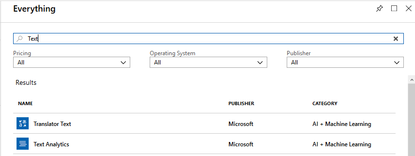
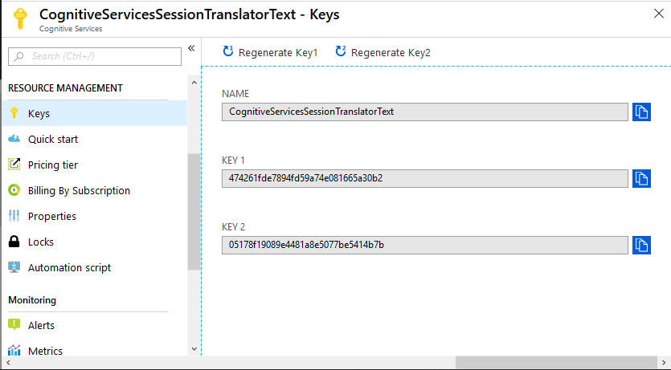
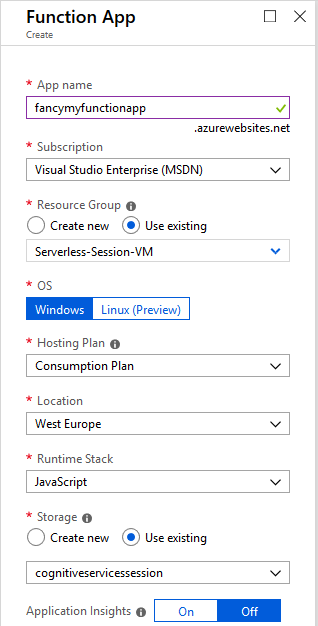
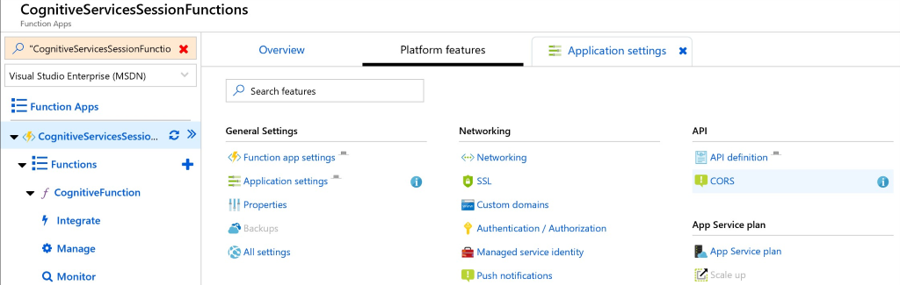
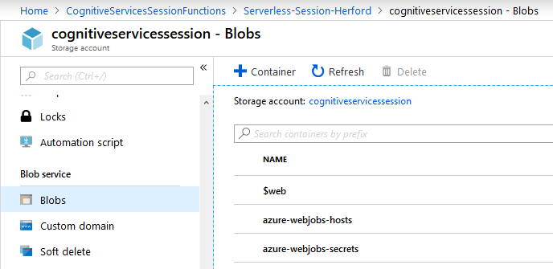

# Introduction 
This repository is used to support a Hands-On Session "*Serverless and Cognitive Services*".

After performing all steps you will be able to navigate a browser to a website, enter text in different languages and get translated (to german) text with a sentiment back. This data is shown on the page.

# Getting Started
This guid consists of multiple parts:
1.	[Install required software](#Install-software)
2.	[Setup Azure Services](#Setup-Azure-Services)
3.	[Deploy bits to run the hands-on](#Deploy-Bits)

# Install software
All used software is available for free. You'll need to install:
1. .NET Core SDK

    The Extension for Visual Studio Code requires the **.NET CORE SDK** to be installed. Grab it [here](https://www.microsoft.com/net/download).

2. Visual Studio Code

    Download and install VSCode from [https://code.visualstudio.com](https://code.visualstudio.com).
3. Node.js

    Download and install Node 8.12+ from [https://nodejs.org/](https://nodejs.org/). You do not need to install *necessary tools* at the step the installer suggests.
4. Extensions and Tools

    After you've installed VSCode you need to start it once, so it will react to the following link. Then install the [Azure Functions Extension](vscode:extension/ms-azuretools.vscode-azurefunctions) to be able to deploy Code to a Function App by clicking on the green **Install** button within the extension.

    You need to install [Azure Functions Core Tools (V2)](https://github.com/Azure/azure-functions-core-tools#installing). Use NPM, [Chocolatey](https://chocolatey.org/) or whatever you prefer :-) Part of the installation will be the Azure Cli.
5. Git

    Download the [Windows Git client](https://git-scm.com/download/win) to clone the repository with the sourcecode. The installation offers a lot of configuration. You can stick with the default settings.

# Setup Azure Services
To group the necessary services, it is recommended to use a separate resource group. In that group you need to create the following services:

- [Storage Account](#Storage-Account)
- [Cognitive Services](#Cognitive-Services)
- [Function App](#Function-App)

Logon to the [Azure Portal](https://portal.azure.com) and navigate to the previously create Resource Group, or create a new one.

## Storage Account
Create a storage account and set the Account kind to **StorageV2 (general purpose v2)**. Next activate the static website hosting feature (currently in preview).


Please enable the **Static website** feature and set the Indes and Error document to *index.html*. This demo will not use a dedicated error document.

## Cognitive Services
The solution uses the services *Text Translation* and *Text Analytics*. Both of them need to be create separately.

Both can be create by clicking on add and entering "Text" as filter.



Create both services mentioned above and remember the keys.



The keys will be used later, to authenticate in order to use the services.

## Function App
Part of the solution is an Azure Function that leverages two Cognitive services for a passed text.
So let's create a Function App.



Use the same Resource Group that you've been using for the storage account and Cognitive Services. Select **Windows**, **Consumption Plan** and **JavaScript**. 

Remember the keys you needed to write down in the previous chapter? Grab them, because we need them now.
Since we do not want to use keys in the sourcecode itself, we'll place them in the application settings and access them through environmental variables. That way the can be changed on the fly and are not stored in a sourcecontrol system.

---
In case you get a white page when navigating to your Function App, try another browser.
***

Go to the Platform features blade from where you can access the Application and CORS settings.



1. Go the the application settings of the Function app and add the access keys in the **Application Settings** section.

   | Key | Value |
   | --- | ----- |
   | ANALYTICS_TEXT_KEY | 20de52f548644252bfe152bef6bce675 <-- this should be YOUR key |
   | TRANSLATOR_TEXT_KEY | 474261fde8894fd59a74e081665a30b2 <-- this should be YOUR key |

2. Set a CORS policy

   Otherwise the browser would query for data later on, but not show anthing of it and hide the error in the console.

   Remove all existing entries and add one **ALLOWED ORIGINS** with the value "*" (just a star).

### Further Reading ###
In case you want to know more (or create your own Function) the links will enable you to do so: 
- [https://docs.microsoft.com/en-us/azure/azure-functions/functions-create-first-function-vs-code](https://docs.microsoft.com/en-us/azure/azure-functions/functions-create-first-function-vs-code)
- [https://docs.microsoft.com/en-us/azure/cognitive-services/translator/quickstart-nodejs-translate](https://docs.microsoft.com/en-us/azure/cognitive-services/translator/quickstart-nodejs-translate)

# Deploy Bits

## Clone the repository
This step downloads all files from GitHub to a local folder on your machine. ```git clone https://github.com/ArvatoSystems/Serverless-HandsOn2.git``` will create a folder **Serverless-HandsOn2** in the current directory and download all files from the repository.

Finally we can deploy our website and Function to see the magic happen.

1. chdir into the subfolder **Serverless** and type ```code .``` (or open the folder via Explorer context menu).
2. Now you need to sign in to Azure and deploy the Function. [This page](https://docs.microsoft.com/en-us/azure/azure-functions/functions-create-first-function-vs-code#sign-in-to-azure) will help you with the necessary steps. (Watch for a small popup window at the lower right of VSCode)
3. The newly deployed function has its own URL. We need it for the website to be able to leverage the function. So go to the function in your browser and copy the URL.

    
4. Open the **Website** folder of the cloned repository with VSCode.
5. Adjust the Function App URL in the **variables.js** files. Set the variable **functionUrl** to the value of your Function App.
6. Navigate to the Storage account in your browser and click on the **$web** container.

    
7. Upload **index.html**, **demo.css**, **demo.js** and **variables.js** from the websites folder. You can use drag&drop or the Upload button in the Portal.

That's it. Get back to the Storage account in the browser to copy the URL from the *Static website* blade.